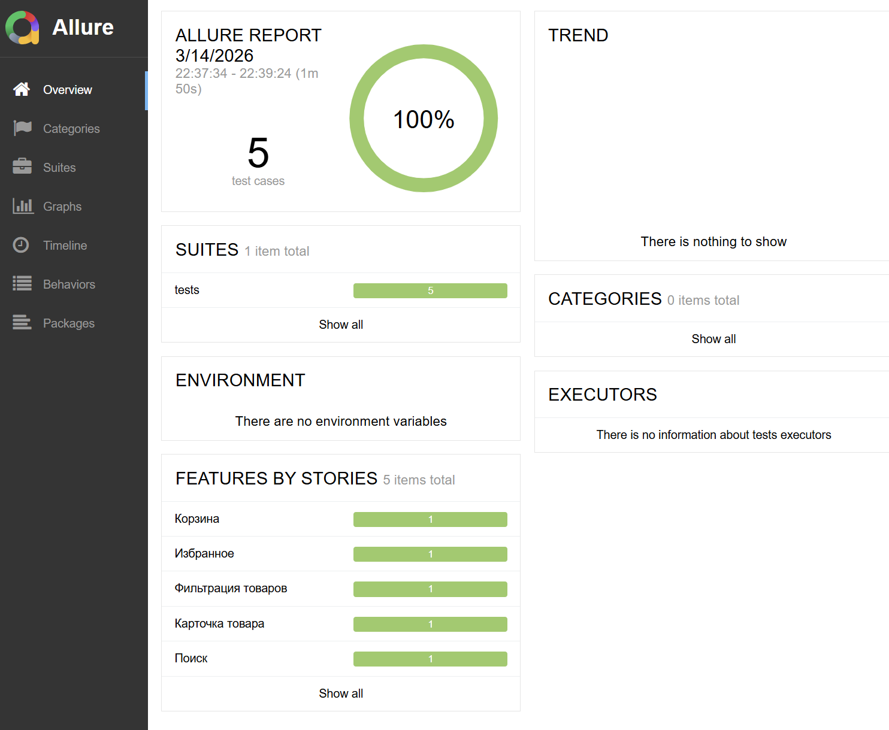

```commandline
python -m venv venv 
.\venv\Scripts\activate 
pip install -r requirements.txt
playwright install            
pip install pytest-xdist
scoop install allure

pytest tests/ -v --alluredir=allure-results --test-browser=chromium                           
pytest --alluredir=./reports ./tests -n=4    
allure serve .\reports\                             
```

